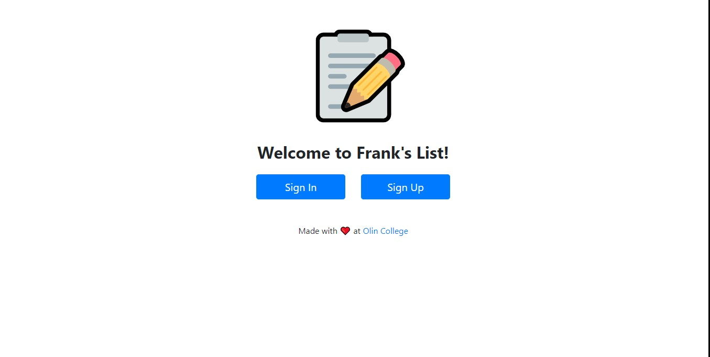
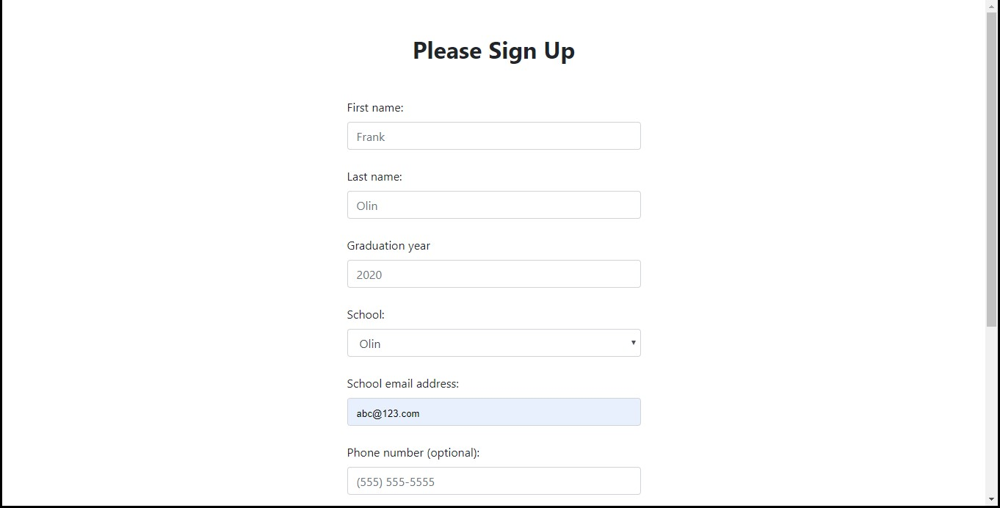
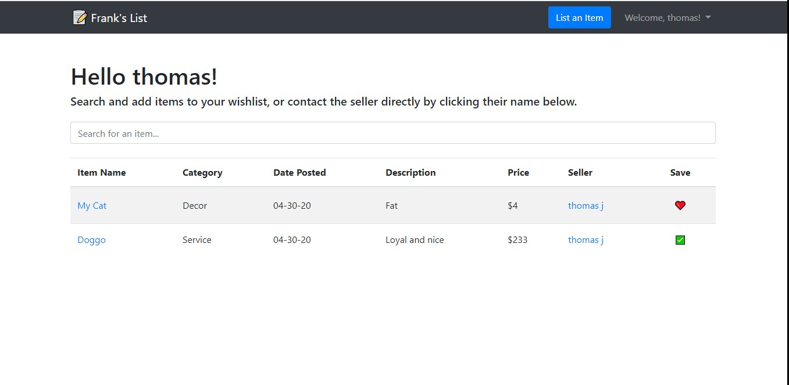
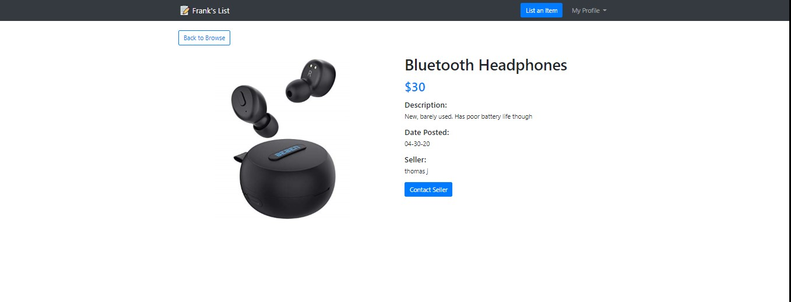
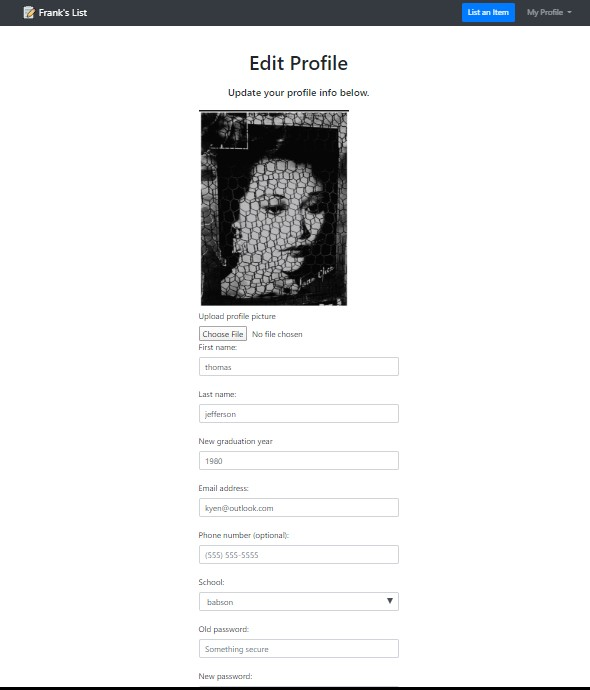
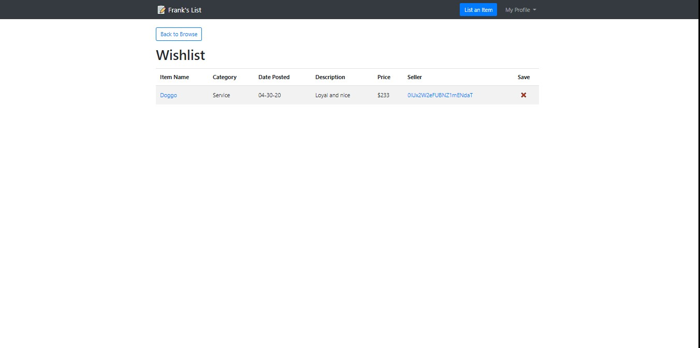
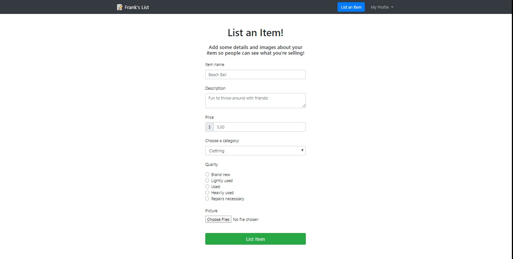
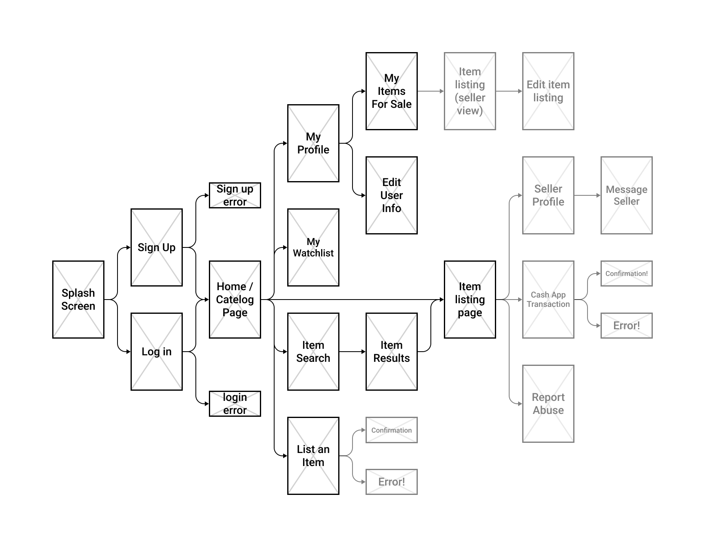

 

# Frank's List 
### A simple web app for buying and selling items within the [BOW](https://www.bow3colleges.org/) community, created by [Jasper Katzban](https://github.com/jasperkatzban/), [Kelly Yen](https://github.com/jellyyams/), and [Jonas Kazlauskas](https://github.com/jonaskaz) at [Olin College](http://www.olin.edu/).

## What is it?
Our goal is to build an online store for college students to sell and buy second-hand goods from each other at an affordable price. It would function similarly to Craigslist, but without the risk of interacting with complete strangers, and would be designed to cater towards college student’s needs. A website like this will help reduce the waste and make it easier for students to exchange items. This is a final project for a [Software Design](https://sd2020spring.github.io/) course at [Olin College of Engineering](http://www.olin.edu/). 

## How do I use it?
In order to use this webapp, make sure you install flask and firebase admin, and then run web.py to initialize the local server. 
- what to put here tho?
- User instructions/README Information to help users download, install, and get started running your software (README rubric)

Before being able to use the website, users need to sign up for an account, which requires them to provide their full name, home institution, graduation year, and email. If the user tries to sign up with an email that isn’t on an approved list, the user will be unable to sign up (this feature is built in to prevent people who don’t go to the college from using the website). 

Once the user has signed up and logged in with valid credentials, they can start browsing through the available items using the search bar to help navigate. Users can also list their own items by clicking on the “list item” button in the nav bar. When listing an item, users provide the item’ name, description, price, quality, and images. 

If a user finds an item they are interested in purchasing eventually, they can save that item to their wishlist by clicking on the “save” button in the user home page. To view their wishlist, users can click on the drop down menu in the top navbar, and select “wishlist”. To remove items from their wishlist, users can click on the x button next to each item. 

Users can also manage the items they're selling by clicking on the “selling” button in the top navbar. Users have the option to unlist items and edit listings. 

Users can edit their user profile and submit a profile picture. 

(move the above to sections below)

#### Getting Started
- public web hosting?
- sign up page
- requirements for sign up page (BOW domain email)

#### Browsing Items
- userhome
- search
- intro to categories and general data structure of items
- toggling different views? WIP

#### Viewing an Item
Click on an item to view it's details, and click the Contact Seller button to send an email regarding that item to the person selling it.
- view item page

#### Contacting a Seller
- show button methods on userhome and on item page

#### Editing Your Profile
- edituser page

#### Adding an Item to your Wishlist
- adding and removing items from user home
- viewing and removing items from wishlist page

#### Listing an Item
- item listing page
- edit item listing page

#### Viewing your purchase and sale history
- purchase history
- sale history

#### Signing Out
- how to logout

## How does it work?
Our website utilizes a variety of tools and libraries. We use a firebase firestore database to store all of the user and item information. Our website uses flask to host and serve webpages, and the bootstrap library to help style and organize each webpage. 

## Impact
For our project, we wanted to create something that could be legitimately used by members of our college community and beyond. Though our work is not deeply rooted in any ethical agendas or goals, we did see this as an opportunity to add value to the world while learning some new software development skills along the way.

At Olin, we have a strong focus on preparing students for the world of entrepreneurship and learning how to solve real problems in uncharted waters. One of our foundation courses, Products & Markets, does just this - and previous work by a team member in that course was the inspiration for the core functionality of this project.

At Olin, we have a system called ‘CarpeDiem’ or ‘carpe’ for short - it’s a mailing list that serves as a bulletin for members of our community to share thoughts, events, resources, and to sell items. We saw that, although this system works well as a whole, it lacked specific features necessary to buying and selling items. In other words, Craigslist via email is a big no. 

With this in mind, we decided to create a web app that allowed for the easy buying and selling items within the college community. <add more from P&M>

## Project Evolution
We began wireframing our website MVP:

Next, we created a set of simple HTML templates that displayed some text and were routed using flask. From there, we started learning how to pass data into and out of the pages using the flask and HTML forms, and defined some of our classes like item and user. <insert early stage picture>.

After our first architectural review, we decided to use firebase to store data. We quickly learned how to work with this package, and started building out more simple html pages and displaying data. <sentence about hashing passwords? Or other cool stuff kelly did like images>

This work continued fairly linearly, and we eventually decided we wanted it to look pretty. This is when we implemented bootstrap to quickly add formatting and beautify the website. <insert ugle image then pretty image XD> This work continued while we built out the rest of our pages. <idk show some cool features or something in a pic>. 

Some of our stretch goals include hosting this project, adding financial transactions, and ~~moving it to the third dimension using either solidworks or matlab.~~

- initial motives
- planning phase
- initial implementation
- resources we used over time
- feature map?
- current features vs stretch goals

## Attribution
We used the following libraries and packages to build the core functionality of our app:
- [Python 3](https://www.python.org/)
- [Flask](https://flask.palletsprojects.com)
- [Firebase](https://firebase.google.com/)
- [Bootstrap](https://getbootstrap.com/)

We'd also like to thank our SoftDes professors [Steve Matsumoto](https://www.stevematsumoto.net/) and [Amon Millner](http://www.amonmillner.com/), as well as the amazing NINJAs and our peers. 

- shreya? can we link to her project? or at least give her some clout?

## Some things we want from this review:
We would like feedback on where our code can be more elegant/efficient, and how best to test the robustness of our website. We’d also like advice on what we should focus on for the last week of this project. We would also like feedback on the overall user experience of the website and if there’s anything we can do to make it better.
